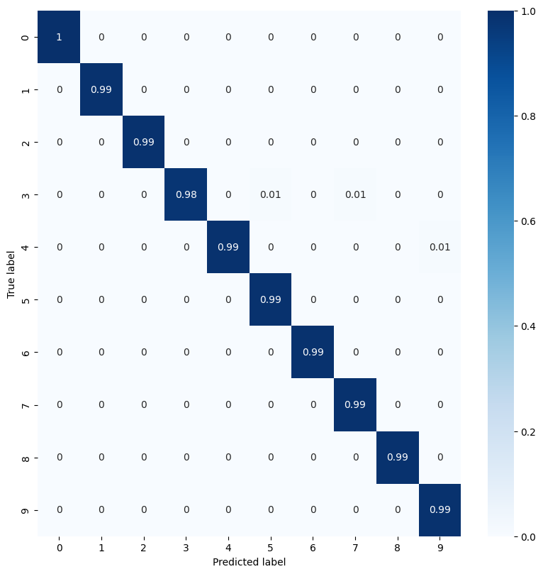

# Projeto: Cálculo de Métricas de Avaliação de Aprendizado de Máquina

Este repositório contém a implementação de um projeto para calcular as principais métricas de avaliação de modelos de classificação, utilizando uma Rede Neural Convolucional (CNN) treinada no dataset MNIST como caso de estudo.

---

## 🎯 Objetivo

O objetivo principal deste projeto é demonstrar o cálculo e a interpretação das seguintes métricas de avaliação de modelos de classificação:
* Acurácia
* Sensibilidade (Recall)
* Especificidade
* Precisão
* F-score

Para isso, o notebook utiliza os valores de Verdadeiros Positivos (VP), Falsos Negativos (FN), Falsos Positivos (FP) e Verdadeiros Negativos (VN) extraídos de uma matriz de confusão. 

## 🛠️ Tecnologias Utilizadas

* **Python 3**
* **TensorFlow / Keras:** Para a construção e treinamento da Rede Neural.
* **NumPy:** Para manipulação de arrays numéricos.
* **Matplotlib & Seaborn:** Para a visualização de dados e da matriz de confusão.
* **Pandas:** Para a estruturação e exibição dos dados.
* **Google Colab:** Como ambiente de execução.

## 🚀 Como Executar

O projeto foi desenvolvido para ser executado no ambiente do **Google Colab**, que já fornece todas as dependências necessárias e acesso gratuito a GPUs para acelerar o treinamento.

1.  **Abra o Notebook no Google Colab:**
    * Clique no botão  no topo deste README ou acesse o link direto.

2.  **Habilite a GPU:**
    * No menu do Colab, vá em `Ambiente de execução` -> `Alterar o tipo de ambiente de execução`.
    * Selecione `GPU` como acelerador de hardware e salve.

3.  **Execute as Células:**
    * Execute todas as células em sequência, clicando em `Ambiente de execução` -> `Executar tudo`.

## 📂 Estrutura do Notebook

O notebook está organizado da seguinte forma:

1.  **Importação de Bibliotecas:** Carregamento das ferramentas necessárias.
2.  **Carregamento e Preparação dos Dados:** O dataset MNIST é carregado, redimensionado e normalizado.
3.  **Construção e Treinamento do Modelo:** Uma Rede Neural Convolucional (CNN) é definida, compilada e treinada com os dados de treino.
4.  **Geração da Matriz de Confusão:** O modelo treinado faz previsões nos dados de teste e a matriz de confusão é calculada e visualizada.
5.  **Cálculo das Métricas de Avaliação:** Um loop itera sobre cada classe (dígitos de 0 a 9) para calcular a Acurácia, Precisão, Sensibilidade, Especificidade e F-score, exibindo os resultados detalhados.

## ✅ Resultados

O modelo treinado alcança uma alta performance na classificação dos dígitos, o que é refletido na matriz de confusão, que apresenta uma diagonal principal forte, e nas métricas calculadas, que possuem valores elevados para todas as classes.

**Matriz de Confusão Gerada:**

O projeto cumpre com sucesso o objetivo de calcular e apresentar as métricas, demonstrando o entendimento prático de como avaliar um modelo de classificação.

## ✍️ Autor

**Edemilson Fernandes Vieira**

* [LinkedIn](https://www.linkedin.com/in/edemilson-fernandes-vieira/)
* [GitHub](https://github.com/ede1000son)

---